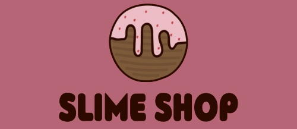

    

# Welcome to the slime shop

> An online store frontend mock application

  

## :pushpin: Summary

- [Welcome to the slime shop](#welcome-to-the-slime-shop)
  - [:pushpin: Summary](#pushpin-summary)
  - [:rocket: Features](#rocket-features)
  - [:link: Demo](#link-demo)
  - [:closed_book: License](#closed_book-license)

## :rocket: Features

* :iphone: Completely responsive application
* :mag: Product search
* :shopping_cart: Add to shopping cart

## :link: Demo

Click [here](https://lojaslime.kellina.com.br) to access the page

## :closed_book: License

Released in 2020.
This project is under the [MIT license](https://github.com/kellina/loja-slime-front/blob/master/LICENSE).

Made with love by [Kellina Oliveira](https://github.com/kellina) :purple_heart: :rocket:
